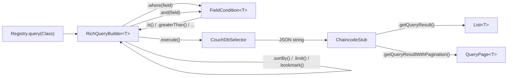
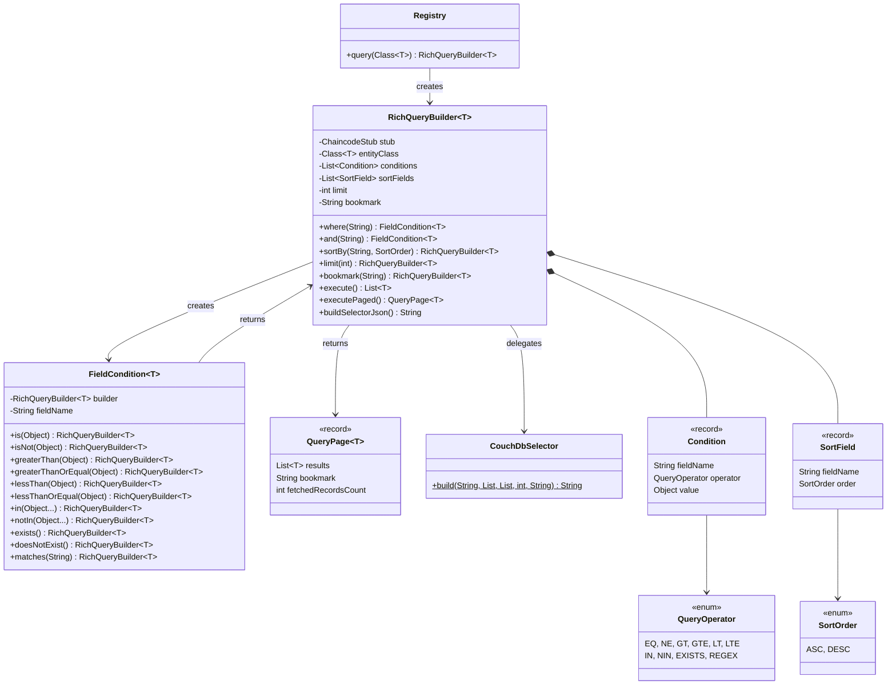

# Hypernate Rich Query Builder — Design & Implementation

## Overview

This document covers the fluent rich query builder API added to Hypernate as the coding challenge solution. The builder abstracts CouchDB Mango selectors behind a composable, type-safe Java API integrated directly into the existing `Registry`.

## Target API (from the challenge)

```java
List<Asset> results = registry.query(Asset.class)
    .where("color").is("blue")
    .and("size").greaterThan(10)
    .and("owner").in("Alice", "Bob")
    .sortBy("value", SortOrder.DESC)
    .limit(50)
    .execute();
```

**This exact API is fully implemented and tested.**

---

## Architecture



### Class Diagram



---

## Supported CouchDB Operators

| Java Method | CouchDB | Example |
|-------------|---------|---------|
| `.is(value)` | `$eq` | `"color": {"$eq": "blue"}` |
| `.isNot(value)` | `$ne` | `"color": {"$ne": "red"}` |
| `.greaterThan(value)` | `$gt` | `"size": {"$gt": 10}` |
| `.greaterThanOrEqual(value)` | `$gte` | `"size": {"$gte": 10}` |
| `.lessThan(value)` | `$lt` | `"size": {"$lt": 100}` |
| `.lessThanOrEqual(value)` | `$lte` | `"size": {"$lte": 100}` |
| `.in(values...)` | `$in` | `"owner": {"$in": ["Alice","Bob"]}` |
| `.notIn(values...)` | `$nin` | `"owner": {"$nin": ["Eve"]}` |
| `.exists()` | `$exists: true` | `"field": {"$exists": true}` |
| `.doesNotExist()` | `$exists: false` | `"field": {"$exists": false}` |
| `.matches(pattern)` | `$regex` | `"color": {"$regex": "^bl.*"}` |

---

## Pagination

The builder supports cursor-based pagination through Fabric's `getQueryResultWithPagination` API:

```java
// Page 1
QueryPage<Asset> page1 = registry.query(Asset.class)
    .where("color").is("blue")
    .limit(10)
    .executePaged();

List<Asset> items = page1.results();
String nextBookmark = page1.bookmark();
int fetched = page1.fetchedRecordsCount();

// Page 2
QueryPage<Asset> page2 = registry.query(Asset.class)
    .where("color").is("blue")
    .limit(10)
    .bookmark(nextBookmark)
    .executePaged();
```

**API behavior:**

| Method | Stub API Used | Return Type |
|--------|--------------|-------------|
| `execute()` (no limit/bookmark) | `getQueryResult()` | `List<T>` |
| `execute()` (with limit or bookmark) | `getQueryResultWithPagination()` | `List<T>` |
| `executePaged()` | `getQueryResultWithPagination()` | `QueryPage<T>` |

---

## Index Validation via `@QueryIndex`

The `@QueryIndex` annotation can be placed on entity classes to declare CouchDB indices. At query execution time, the builder logs warnings for any queried or sorted fields not covered by an index:

```java
@QueryIndex(name = "colorSizeIdx", attributes = {
    @AttributeInfo(name = "color"),
    @AttributeInfo(name = "size")
})
public class Asset { ... }
```

If you query `.where("owner").is("Alice")` on this entity, a warning is logged:
```
WARN  Field 'owner' is used in a query condition on Asset but is not covered by any @QueryIndex
```

This is a **best-effort development aid** — missing indices won't prevent queries from executing, but CouchDB will fall back to a full collection scan.

---

## Design Decisions

### 1. Two-step fluent pattern (`where` → `FieldCondition` → `RichQueryBuilder`)
The intermediate `FieldCondition` enforces that every field reference is paired with exactly one operator — you can't call `.where("color").sortBy(...)` without first specifying a comparison. This catches misuse at compile time.

### 2. Implicit AND semantics
All conditions combine with implicit `AND`, matching CouchDB's default selector behavior. `.and()` is a semantic alias for `.where()` that reads more naturally in chains.

### 3. `docType` scoping
Every generated selector includes a `"docType"` field matching the uppercased class name used by `Registry` for composite keys. This ensures queries only return entities of the correct type.

### 4. Package-private internals
`Condition`, `SortField`, `QueryOperator`, and `CouchDbSelector` are package-private. Only `RichQueryBuilder`, `FieldCondition`, `SortOrder`, `QueryPage`, and `RichQueryException` are public — keeping the API surface minimal.

### 5. `buildSelectorJson()` for testability
Exposing the JSON output without executing the query allows unit tests to verify selector generation independently of stub interaction.

### 6. Automatic pagination API selection
`execute()` automatically selects the correct Fabric stub method — `getQueryResult()` for simple queries, `getQueryResultWithPagination()` when limit or bookmark are set. This ensures correct pagination semantics without requiring developers to think about which low-level API to call.

---

## Conscious Deferrals & Future Directions

### `$or` / logical combinator support
CouchDB Mango supports `$or`, `$not`, and `$nor` at the top level. The current API only supports implicit `AND` (all conditions are ANDed together). This is a deliberate simplification for the initial implementation. A future extension could support:

```java
// Potential future API:
registry.query(Asset.class)
    .where("color").is("blue")
    .or(q -> q.where("size").greaterThan(50))
    .execute();
```

This was deferred because `$or` introduces nesting complexity in both the builder pattern and the JSON serializer, and is less commonly needed than `AND` conditions in typical chaincode queries.

### Compile-time field name safety
Field names are currently raw strings, meaning typos like `.where("collor")` compile but fail silently at runtime. Potential future approaches include:

- **Lombok `@FieldNameConstants`**: `.where(Asset.Fields.color)` — works today with no framework changes
- **Annotation-processed metamodel**: `.where(Asset_.color)` — requires a code generation step, similar to JPA's metamodel generator

This aligns with the mentorship's stretch goal of exploring code generation tooling to auto-generate boilerplate from annotated entity classes.

---

## Architectural Note: Backend Separation

Following the framework's design philosophy, this Rich Query API is explicitly separated from the standard Key Range Scan API (`Registry.readAll()`). 

As rich queries (CouchDB) and range scans (LevelDB/CouchDB) have radically different semantics—specifically regarding transaction isolation and "read-set" validation in Hyperledger Fabric—they are exposed via distinct entry points. This ensures that developers are making a conscious choice to use the CouchDB-specific rich query path, acknowledging its requirement for a CouchDB state database and its specific behavior during the Fabric transaction lifecycle.
